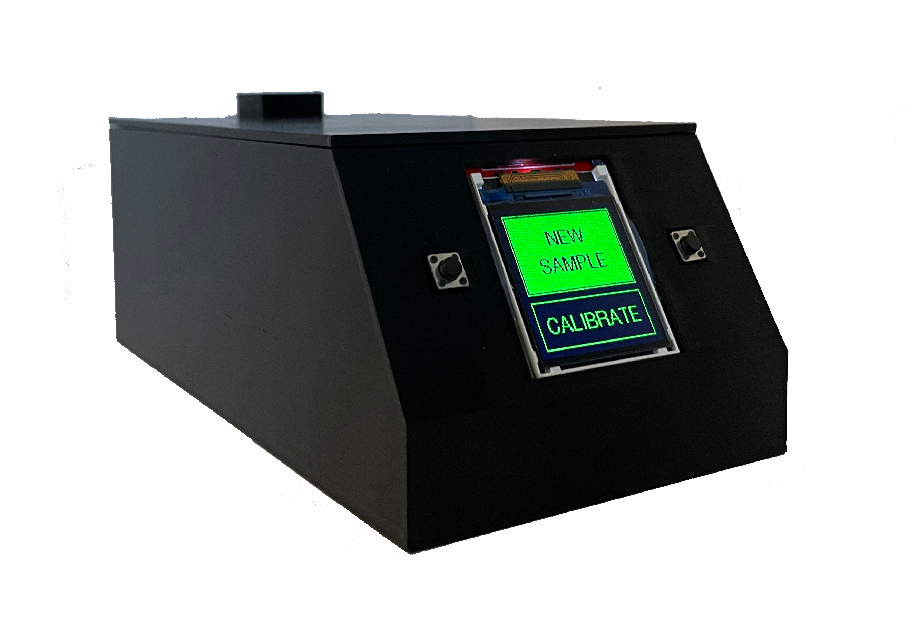
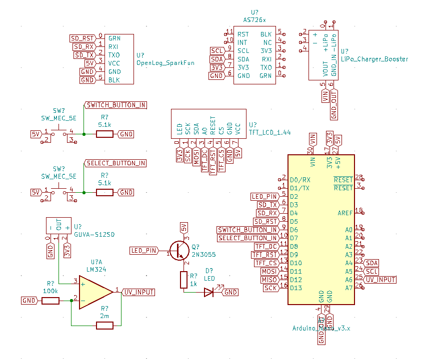

# SpinalSolution: A Cerebrospinal Fluid Leakage Detection Device for the Emergency Room (2021)

  
  

<i>CSF leakage detection device</i>

## Overview

This repository contains models and code for SpinalSolution, a Grade 11 (2021) personal project aimed at developing an electronic device to detect cerebrospinal fluid (CSF) leakage in emergency rooms. The project was motivated by the need to improve the accuracy and speed of CSF detection in trauma patients, where current methods like the halo sign test often yield unreliable results.

More information about the project can be found [here](https://projectboard.world/ysc/project/spinal-solution-developing-an-electronic-device-to-detect-cerebrospinal-fluid-in-the-emergency-room).

## Our Solution

The CSF leakage detection device enhances the accuracy of CSF leakage detection by:

1. **Monitoring a Chemical Reaction**: Beta-2-transferrin found in CSF reduces gold (III) chloride to produce gold nanoparticle clusters that alter the optical properties of the sample.
2. **Leveraging Computational Power**: Through computational analysis, the device rapidly detects CSF presence by analyzing optical sensors, improving the  reliability of diagnostics.

## Hardware

- **Arduino Uno R3**: Serves as the main microcontroller for the device.
- **AS726X Spectral Sensor**: Used to measure visible light absorption and emittance.
- **1.44" TFT LCD Display**: Displays the results and status of the analysis.
- **GUVA-S12SD UV Sensor**: Used to measure ultraviolet light.
- **OpenLog SD Card Module**: For logging data to an SD card and storing configuration files.
- **Push Buttons**: Used to navigate and control the device’s functions.

## Setup

1. **3D Case and Cartridges**: Use the provided STL files to print the case that houses the components securely.
2. **Assemble Reagent Cartridges**: Utilize springs and rubber gaskets to assemble the 3D printed reagent cartridges.
3. **Wire Together the Hardware**:
    - Connect the **TFT LCD Display** to the Arduino: CS to pin 10, RST to pin 9, DC to pin 8.
    - Connect the **AS726X Spectral Sensor** to the Arduino via I2C: SDA to A4, SCL to A5.
    - Connect the **GUVA-S12SD UV Sensor** to the Arduino: Analog output to pin A2.
    - Connect the **OpenLog SD Card Module** to the Arduino: RX to pin 3, TX to pin 4, RST to pin 5.
4. **Flash the Firmware**: Use the Arduino IDE to upload the chosen Arduino sketch to the Arduino Uno R3.
5. **Build Calibration Curve and Calculation Model**: Test the device with known CSF samples to generate a calibration curve. Implement a calculation model based on your device's results.

## Files

- `/models/case_body.stl`: 3D model for the body of the device's case.
- `/models/case_lid.stl`: 3D model for the lid of the device's case.
- `/models/cartridge_container.stl`: 3D model for cartridge containers.
- `/models/cartridge_valve.stl`: 3D model for cartridge valves.
- `/models/cuvette_holder.stl`: 3D model for cuvette holders compatible with the device.
- `/src/SpinalSolution_Barebones.ino`: Arduino sketch for a barebones build.
- `/src/SpinalSolution_Detailed.ino`: Arduino sketch for a more featured build with real-time graphing.

## Circuit Schematic

  
  <i>Cicuit schematic</i>

## License

This work is licensed under the [GNU General Public License v3.0](https://www.gnu.org/licenses/gpl-3.0.en.html).
