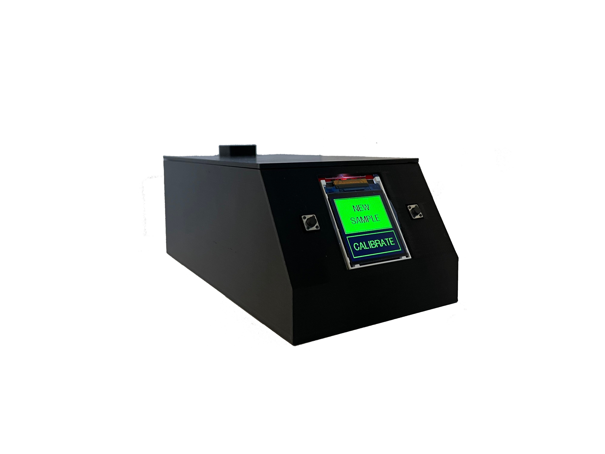

# Spinal Solution: An electronic device to detect cerebrospinal fluid in the emergency room (2021)

  
<i>Spinal Solution CSF Detection Device</i>

## Overview

Cerebrospinal fluid (CSF) is a clear fluid that surrounds and protects the brain and spinal cord. In an emergency room setting, it is vital to decisively differentiate CSF leakage from blood and mucus in trauma patients to avoid life-threatening infections and strokes that can permanently damage the central nervous system. The current CSF detection method, the halo sign test, is a qualitative test that has high rates of false positives and negatives.

## Our Solution: Spinal Solution CSF Detection Device

We present an innovative electronic device designed specifically to enhance the accuracy and precision of CSF leakage detection in ERs. The device functions by:

1. Measuring the absorption and emittance of visible light from a unique chemical reaction.
2. In this reaction, the protein lactoferrin — which models beta-2-transferrin found in CSF — reduces gold (III) chloride (AuCl3) to produce gold nanoparticle clusters that emit light.
3. Harnessing computational capabilities, our device swiftly predicts the reaction's outcome.
4. The end result? A rapid determination of CSF presence, all within a matter of minutes.

More information about the project can be found [here](https://projectboard.world/ysc2021/project/spinal-solution-developing-an-electronic-device-to-detect-cerebrospinal-fluid-in-the-emergency-room).

## Circuit and Wiring Diagrams

  
<i>Top-down view of device internals</i>

  
  <i>Circuit and wiring Diagram</i>

